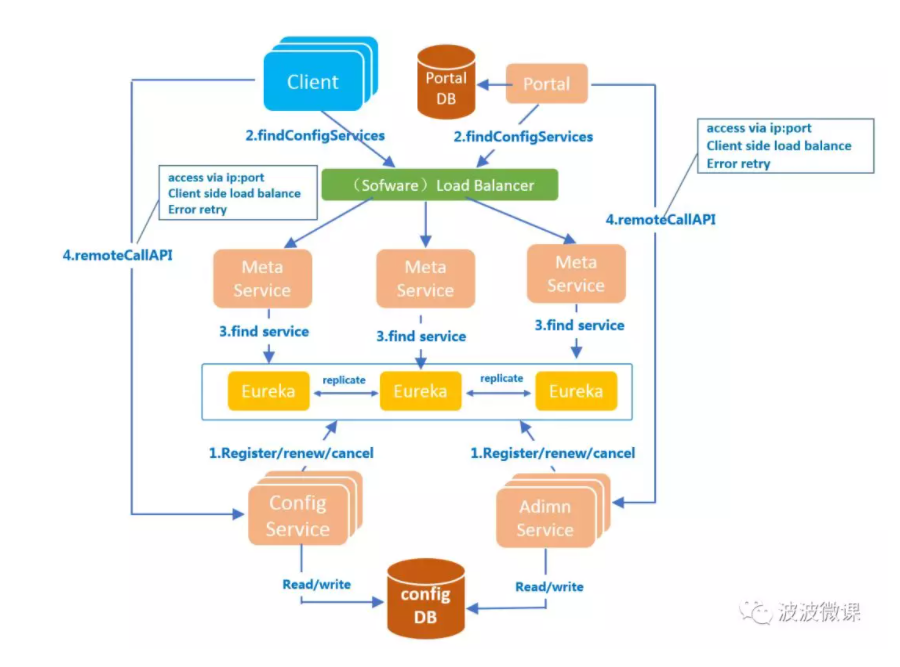
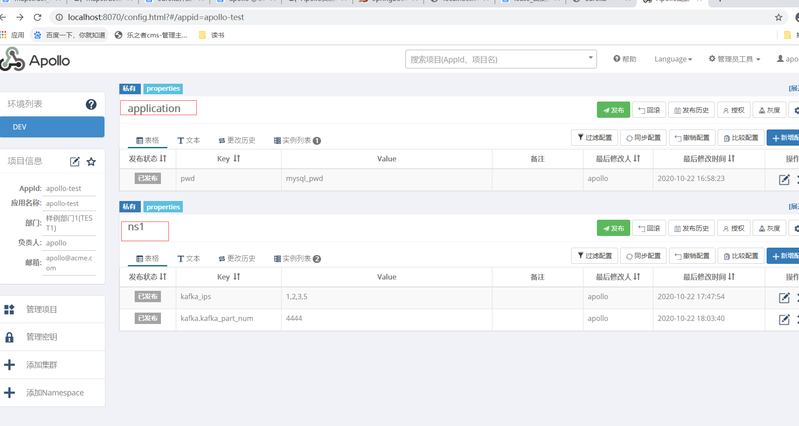

# Apollo几个核心module

## apollo-configservice

config-service  + meta-service + eureka server,注册自己到eureka（http://localhost:8080/）

提供配置的读取、推送等功能，服务对象是Apollo客户端（我们自己的微服务应用）

## apollo-adminservice

注册自己到eureka，http://localhost:8090/

提供配置的修改、发布等功能，服务对象是Apollo Portal（管理界面）

## apollo-portal

web界面的项目，http://localhost:8070/

## 核心模块之间的关系



- 在Eureka之上我们架了一层Meta Server用于封装Eureka的服务发现接口,Meta Server从Eureka获取Config Service和Admin Service的服务信息，相当于是一个Eureka Client,Meta Server只是一个逻辑角色，在部署时和Config Service是在一个JVM进程中的，所以IP、端口和Config Service一致
- Client通过域名访问Meta Server获取Config Service服务列表（IP+Port），而后直接通过IP+Port访问服务，同时在Client侧会做load balance、错误重试
- Portal通过域名访问Meta Server获取Admin Service服务列表（IP+Port），而后直接通过IP+Port访问服务，同时在Portal侧会做load balance、错误重试

#本地安装步骤

##执行sql

```sql
scripts/sql/apolloportaldb.sql
scripts/sql/apolloconfigdb.sql
```

## 修改scripts/build.bat

```bat
rem apollo config db info
rem 因为我的mysql是5.7，apollo使用的驱动是8+,这里需要指定时区
set apollo_config_db_url="jdbc:mysql://localhost:3306/ApolloConfigDB?serverTimezone=UTC&useUnicode=true&characterEncoding=utf-8&useSSL=false"
set apollo_config_db_username="root"
rem 改为自己的mysql密码
set apollo_config_db_password="root"  

rem apollo portal db info
set apollo_portal_db_url="jdbc:mysql://localhost:3306/ApolloPortalDB?serverTimezone=UTC&useUnicode=true&characterEncoding=utf-8&useSSL=false"
set apollo_portal_db_username="root"
rem 改为自己的mysql密码
set apollo_portal_db_password="root"

rem meta server url, different environments should have different meta server addresses
rem 因为只有本地一个环境，故这里只需留一个
set dev_meta="http://localhost:8080"
rem set fat_meta="http://someIp:8080"
rem set uat_meta="http://anotherIp:8080"
rem set pro_meta="http://yetAnotherIp:8080"
```

##执行scripts/build.bat

```shel
./build.bat
```

## 启动

```shell
java -jar apollo-configservice-1.8.0-SNAPSHOT.jar
java -jar apollo-adminservice-1.8.0-SNAPSHOT.jar
java -jar apollo-portal-1.8.0-SNAPSHOT.jar
```

## 访问http://localhost:8080

进入eureka界面

##访问http://localhost:8070

默认登录名/密码：apollo/admin，portal管理页面

## 访问http://localhost:8090

进入eureka界面

# 在springboot中使用apollo

## 1. pom.xml

```xml
<!--引入apollo客户端-->
<dependency>
    <groupId>com.ctrip.framework.apollo</groupId>
    <artifactId>apollo-client</artifactId>
    <version>1.6.0</version>
</dependency>
```

## 2.application.yml

```yaml
app:
  # 与apollo里面的应用id对应
  id: apollo-test
apollo:
  meta: http://localhost:8080
  bootstrap:
    enabled: true
    #apollo里面默认的namespace是application
    namespaces: application,ns1
```

##3.@EnableApolloConfig

##4.配置apollo并编写代码测试

